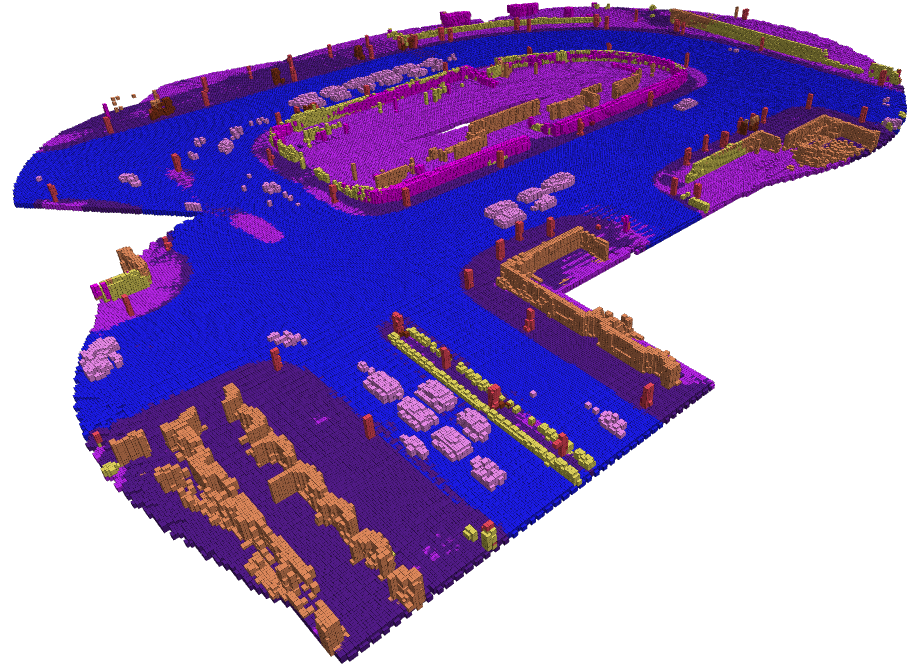

# Learning Aided Semantic Bayesian Kernel Inference

This work extends Lu et. al's original paper on Semantic BKI to operate in dynamic environments.



## Getting Started

### Building with catkin

```bash
catkin_ws/src$ git clone git@github.com:KingArthurZ3/LASt-BKI.git
catkin_ws/src$ cd ..
catkin_ws$ catkin_make
catkin_ws$ source ./devel/setup.bash
```

### Building using Intel C++ compiler (optional for better speed performance)
```
bash
catkin_ws$ source /opt/intel/compilers_and_libraries/linux/bin/compilervars.sh intel64
catkin_ws$ catkin_make -DCMAKE_C_COMPILER=icc -DCMAKE_CXX_COMPILER=icpc
catkin_ws$ source ~/catkin_ws/devel/setup.bash
```

## Semantic Mapping using CarlaSC dataset

### Download Data

Please download the Town10Heavy scene from [MotionSC_11](https://drive.google.com/drive/folders/1_Mom2vipQi3XoOtBoBYlQa_Pelf9rorR?usp=sharing) and uncompress it into the data folder. 
Rename the directory to `carla_townheavy`. These are predictions from the pretrained Neural Network MotionSC on CarlaSC.
For more information about CarlaSC, please refer to [CarlaSC](https://umich-curly.github.io/CarlaSC.github.io/).


### Running Rviz and BKI Layer

```
bash
catkin_ws$ roslaunch semantic_bki carla_node.launch
```
You will see an empty semantic map in RViz. Prepend the ros topic for the map (should be of type MarkerArray) with the ros node name `/carla_node/`

### Publishing MotionSC predictions for incoming point clouds

```
catkin_ws/src/BKINeuralNetwork$ cd ./data
catkin_ws/src/BKINeuralNetwork$ python3 publisher.py
```

Depending on the speed of your processor, you may need to change the default publish rate of the publisher.py file to avoid dropping point cloud scans. By default, 
we maintain a queue for storing unprocessed point cloud scenes temporarily. You will see semantic map in RViz. 

### Evaluation
Evaluation code is provided in `carla_benchmarking.ipynb`. You may modify the directory names to run it. Note: this file was originally run on google colab, users who run evaluations locally can simply replace google drive filepaths with local filepaths.

## Relevant Publications

If you found this code useful, please cite the following:

Bayesian Spatial Kernel Smoothing for Scalable Dense Semantic Mapping ([PDF](https://ieeexplore.ieee.org/stamp/stamp.jsp?tp=&arnumber=8954837))
```
@ARTICLE{gan2019bayesian,
author={L. {Gan} and R. {Zhang} and J. W. {Grizzle} and R. M. {Eustice} and M. {Ghaffari}},
journal={IEEE Robotics and Automation Letters},
title={Bayesian Spatial Kernel Smoothing for Scalable Dense Semantic Mapping},
year={2020},
volume={5},
number={2},
pages={790-797},
keywords={Mapping;semantic scene understanding;range sensing;RGB-D perception},
doi={10.1109/LRA.2020.2965390},
ISSN={2377-3774},
month={April},}
```

Learning-Aided 3-D Occupancy Mapping with Bayesian Generalized Kernel Inference ([PDF](https://ieeexplore.ieee.org/stamp/stamp.jsp?tp=&arnumber=8713569))
```
@article{Doherty2019,
  doi = {10.1109/tro.2019.2912487},
  url = {https://doi.org/10.1109/tro.2019.2912487},
  year = {2019},
  publisher = {Institute of Electrical and Electronics Engineers ({IEEE})},
  pages = {1--14},
  author = {Kevin Doherty and Tixiao Shan and Jinkun Wang and Brendan Englot},
  title = {Learning-Aided 3-D Occupancy Mapping With Bayesian Generalized Kernel Inference},
  journal = {{IEEE} Transactions on Robotics}
}
```
### Acknowledgements

The work was supported by the University of Michigan, Ann Arbor EECS, Naval Architecture, and Robotics departments. Special thanks to Professor Maani Ghaffari and the ROB 530 course staff for their guidance.
